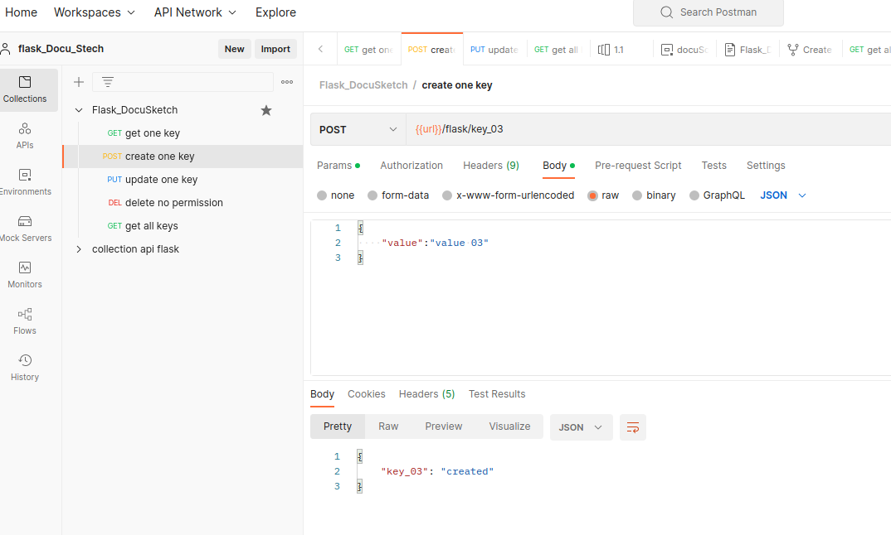

## Flask application for API 
using Redis DB

б) Приложение на python, с использованием Flask, которое слушает на порту 8080 и принимает только методы GET, POST, PUT.

в) Создаем значение ключ(равно)значение, изменяем ключ(равно)новое_значение, читаем значение ключа.

г) Вновь созданные объекты должны создаваться, изменяться и читаться из NoSQL DB.

start app:
```shell 
$ python3 wsgi.py
```
deployed on: http://78.27.202.55:8080/

test app with Postman: 

<a href="https://lively-escape-146551.postman.co/workspace/flask_Docu_Stech~1327aacd-5646-4d79-8df7-087fa63c2403/collection/23239505-05b3298c-edd2-46c5-a4e1-21c72a4a6cf0?ctx=documentation"> 
postman </a>





## Script for monitoring memory usage
script 1: memory_alarm.py 

how to run: 

```shell
$ python3 memory_alarm.py --url 'http://78.27.202.55:8080/flask' --time 60 --message 'short message'
```

```shell
$ python3 memory_alarm.py --help 
```


```shell
curl --location --request POST 'http://78.27.202.55:8080/flask/key_08' --header 'Content-Type: application/json' --data-raw '{"value": "value 08-"}'
```

Using the classic memory profiler
pip install -U memory_profiler